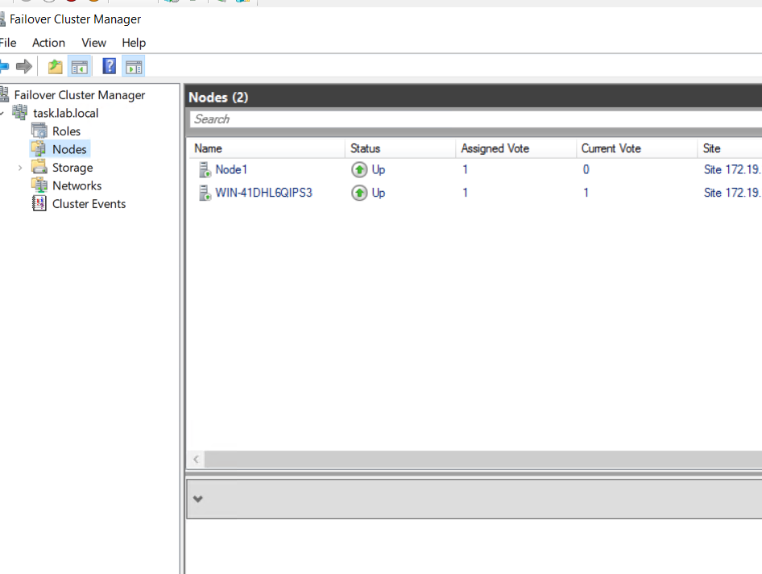
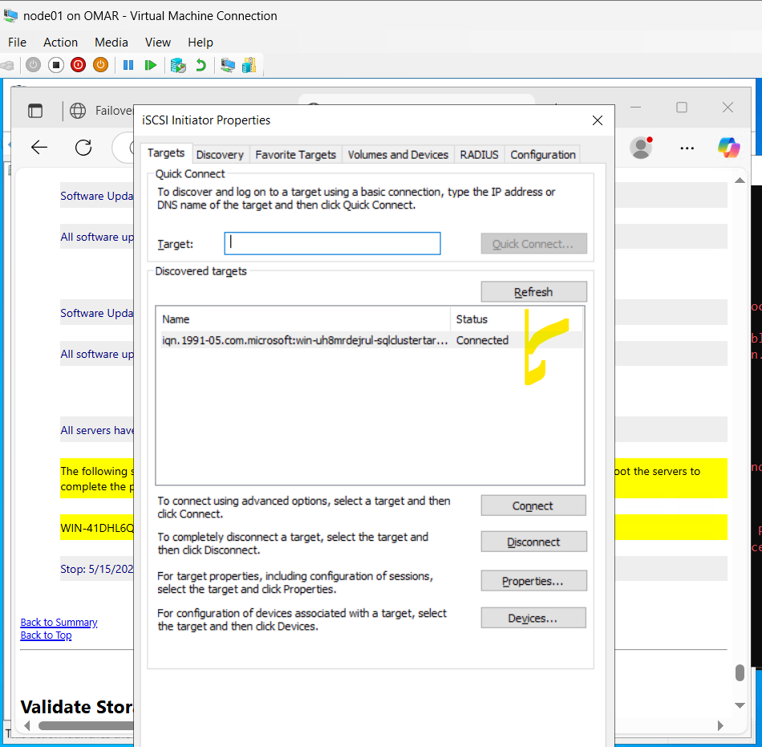
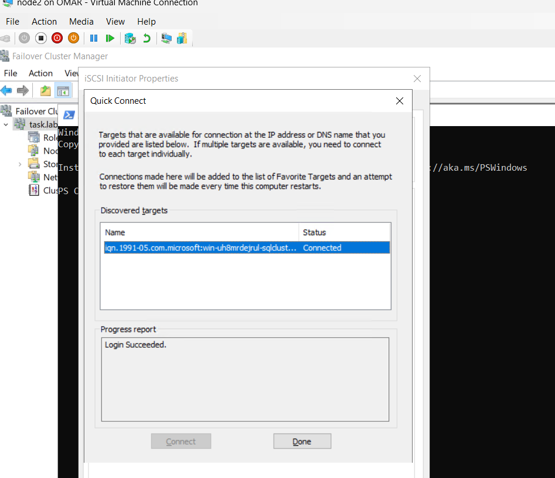
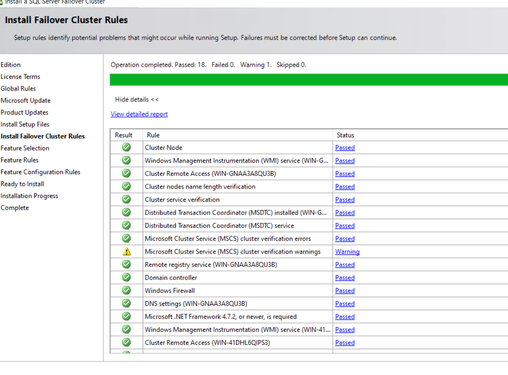
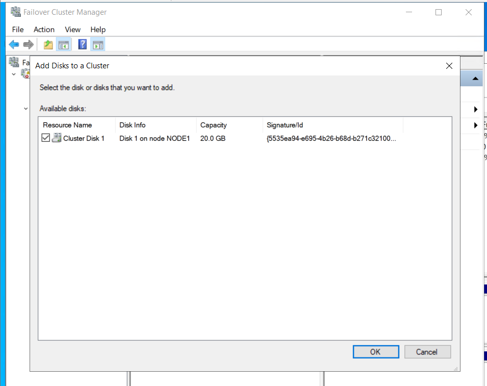
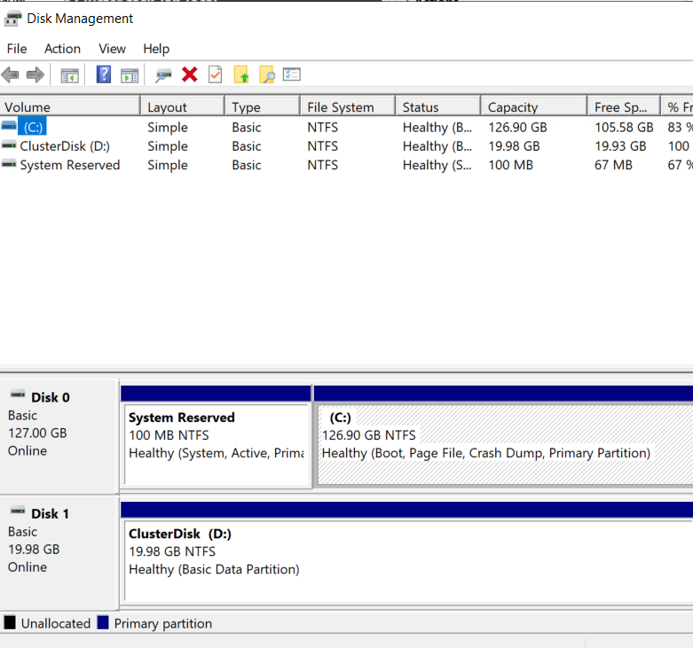
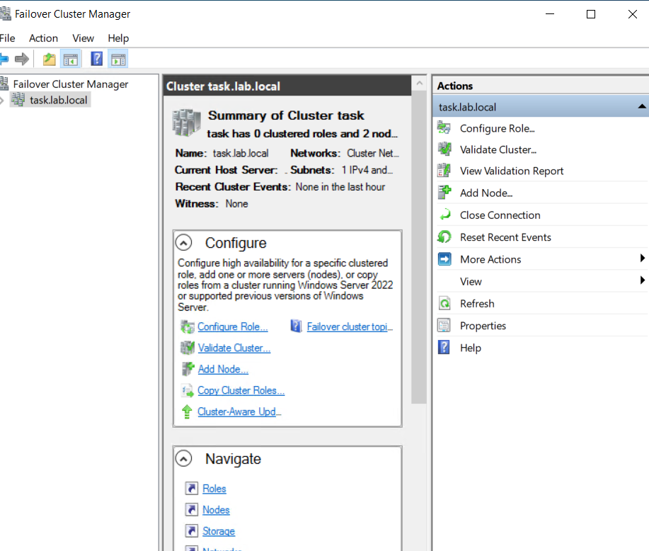
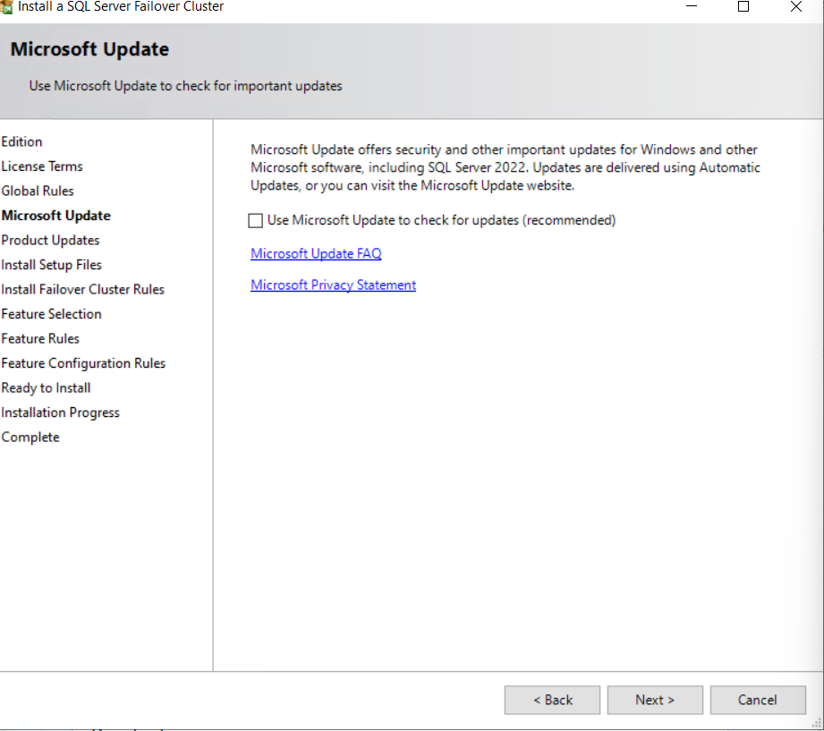

# Hyper-V SQL Server Failover Cluster Setup with CI/CD

This project automates the deployment of a highly available SQL Server Failover Cluster Instance (FCI) using:

* **Hyper-V** for virtualization
* **Windows Server** for cluster nodes
* **Active Directory** for domain integration
* **iSCSI** for shared storage
* **Jenkins CI/CD** to execute provisioning and installation scripts
* **Terraform** to provision infrastructure

---

## 🔧 Prerequisites

* Windows Server with Hyper-V role enabled
* Jenkins installed (with Git and Pipeline plugins)
* Domain Controller already deployed
* SQL Server 2022 ISO downloaded to each node at `C:\SQL2022`

---

## 🌐 Network & Domain Setup

1. Create a **virtual switch** in Hyper-V for private network communication.
2. Provision three VMs:

   * **DC01**: Domain Controller (`lab.local`)
   * **Node1**: Cluster node 1
   * **Node2**: Cluster node 2
3. Join both Node1 and Node2 to the domain.

**Screenshot:**


---

## 🧱 iSCSI Shared Storage Setup

1. Use `iscsicpl.exe` to configure iSCSI Initiator on both nodes.
2. Connect to the target exposed from the host using Microsoft iSCSI Target.
3. Format and mount the shared disk.

**Screenshots:**

* Node1 connected: 
* Node2 connected: 

---

## 🏗️ Failover Cluster Setup

1. Install the **Failover Clustering** feature.
2. Run the **Cluster Validation Wizard**.
3. Create the cluster with a virtual IP.
4. Add shared disk as a cluster resource.

**Screenshots:**

* Validation results: 
* Add disk: 
* Cluster disk added: 
* Cluster summary: 

---

## ⚙️ SQL Server FCI Installation

1. Mount SQL Server ISO to each node.
2. Prepare configuration file `SQLFCI.ini`.
3. Run `install_fci.ps1` on Node1:

```powershell
Start-Process -FilePath "C:\SQL2022\setup\setup.exe" -ArgumentList "/ConfigurationFile=C:\Scripts\SQLFCI.ini" -Wait
```

4. Run `add_node.ps1` on Node2:

```powershell
Start-Process -FilePath "C:\SQL2022\setup\setup.exe" -ArgumentList "/ConfigurationFile=C:\Scripts\SQLAddNode.ini" -Wait
```

**Screenshot:**


---

## 🧪 Validation

* SQL Server Role in Failover Cluster Manager
* Shared storage active
* Manual failover test

---

## 🚀 CI/CD Pipeline

The Jenkins pipeline performs the following:

1. Clones the repo
2. SSHs into Node3 (new name for Node1 replacement)
3. Executes `install_fci.ps1`
4. SSHs into Node2 and executes `add_node.ps1`

Ensure `plink.exe` and `pscp.exe` are in `C:\Windows\System32`.

---

## 🗂️ File Structure

```
├── Jenkinsfile
├── sql-install
│   ├── add_node.ps1
│   ├── install_fci.ps1
│   ├── SQLAddNode.ini
│   └── SQLFCI.ini
├── images
│   ├── cluster-nodes.png
│   ├── iscsi-node01-connected.png
│   └── ...
└── README.md
```

---

## ✅ Summary

You’ve set up a fully functional SQL Server Failover Cluster with:

* Domain-integrated nodes
* Shared storage via iSCSI
* Highly Available SQL Server Instance
* CI/CD automation for cluster deployment

---

Let me know if you want a PDF version or a version with embedded Jenkins pipeline screenshots.
